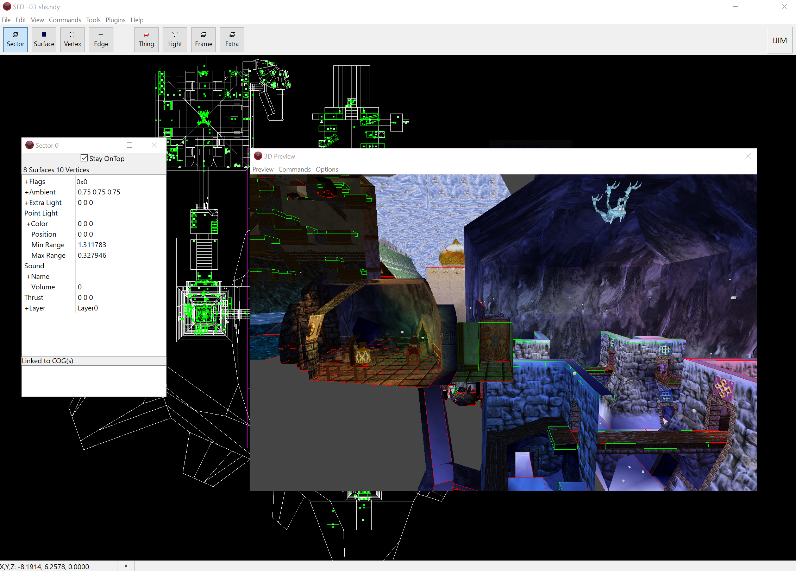

# SED Level Editor

Yet another port of [JED](https://jkdf2.fandom.com/wiki/JED) level editor for games based on the [Sith game engine](https://starwars.fandom.com/wiki/Sith_Engine).  
The editor supports games: [Star Wars Jedi Knight: Dark Forces II](https://en.wikipedia.org/wiki/Star_Wars_Jedi_Knight:_Dark_Forces_II), [Star Wars Jedi Knight: Mysteries of the Sith](https://en.wikipedia.org/wiki/Star_Wars_Jedi_Knight:_Mysteries_of_the_Sith), and [Indiana Jones and the Infernal Machine](https://en.wikipedia.org/wiki/Indiana_Jones_and_the_Infernal_Machine). 

The codebase has been ported to better support modern Windows systems, as well as fixing many bugs and adding numerous new features. Most notably, the 3D Preview has been rewritten to mimic the original rendering system, added support for mouse control and cleaving from any angle. For a full list of changes, see [CHANGELOG.md](CHANGELOG.md).

## Special Thanks

Special thanks go to Alexei Novikov and the Code Alliance for creating the original JED.

## Building

To build the SED editor from source code, use Delphi version 11 or later. You can download it from [https://www.embarcadero.com/products/delphi](https://www.embarcadero.com/products/delphi).

## Releases

See the [Releases](https://github.com/smlu/SED/releases) page for the latest version of SED. 

## License

This project is licensed under the terms of the license detailed in [LICENSE](LICENSE).